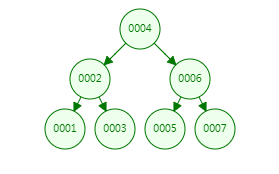
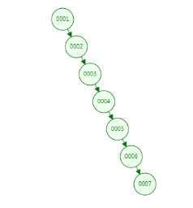
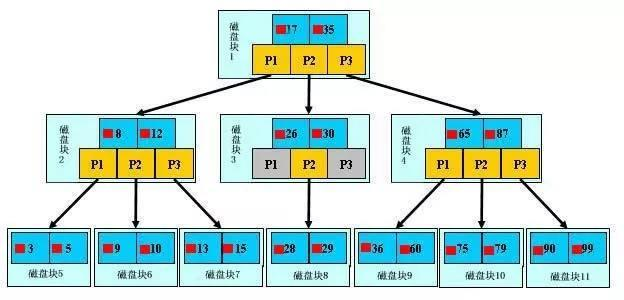
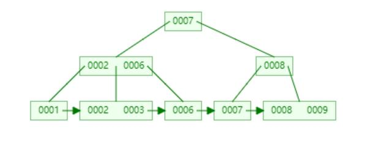

## 二、MySQL引擎

### 1、MyISAM

早期引擎，数据内容与索引结构分开存放为两个文件。

### 2、InnoDB

目前的主流MySQL引擎，数据与索引存放与一个文件当中。


## 三、索引分类

### 0、什么是索引？

索引本质上是一组键值对，其作用是使用数据中某个特定属性作为依据**来快速获得完整数据**，**格式：<索引键：某个属性值，索引值：完整数据 或 完整数据的地址值>**，例如书中的章节目录就是最典型的索引<标题，页数>，通过标题可以快速定位目标数据所在的页数，进而获取数据，无需从起始页一页一页翻找到目标数据。

在MySQL数据库中，索引具有很多类型，它们的区别主要集中在索引键的选取上。

### 1、主键索引 （primary key）

在MySQL数据库中，数据表的主键列会被**默认**创建索引，称为**主键索引**，因此在表查询过程中，使用主键查询的性能非常好。

### 2、普通索引

根据普通列创建的索引，通过手动创建。需要注意的是，创建普通索引需要生成新的索引结构，因此在数据量较大时，会是一个耗时操作；同时索引的维护也是一个耗时操作，所以在创建普通索引时一定要慎重，只有某列确实是高频查询条件时，才考虑依据此列构造索引。

命令格式：

```mysql
create inde idx_col_name(索引名) on table[col_name]（索引所在的表及列名）
```

### 3、唯一索引

在数据表中，某些列具有**特殊属性**，例如值是不重复的（类似于主键），这样的列可以构建唯一索引，其**性能要优于普通索引**。

```mysql
create unique index idx_col_name on table[col_name]
```

### 4、联合索引/组合索引

表中的多个字段创建一个共同的索引，注意这个索引与列的关系是**1：n**，建议一个联合索引不要超过5个列。联合索引的使用方式和其他索引不太一样，因为其对应着多个列，所以在索引命中上要遵循**最左前缀法则**（第五节详述）。

```mysql
create index idx_col_name1_name2... on table[col_name1, col_name2]
```

### 5、全文索引

全文索引是针对文本内容查询的一种索引结构，应用场景更多的是搜索引擎或大数据引擎中，在MySQL环境不太会出现（虽然MyISAM引擎支持全文索引，但实际开发场景中不会用它），目前使用较多的全文索引软件包括**ElasticSearch**、Solr。

### 总结

对于MySQL数据表来说，一定包含：至少一个的主键索引，可以包含：多个普通索引、联合索引。

在查询任务中，能走索引尽量走索引，没有索引可以构建索引，但大量的索引会导致数据表的维护成本升高，因此若是索引过多，则需要考虑是表结构设计有问题或是无法适应当前业务场景的需求。


## 四、索引的存储

使用索引组织数据可提高数据的查询性能，因此有索引和没索引，差距很大，但同时需要注意的是，**使用不同的数据结构存储索引**也会对性能造成巨大的差异，因此要在不同场景下要选用适合的数据结构存储索引。在下文语境中，使用数据结构存储的**数据**指的就是**索引（包括键和值）数据**，只是因为索引键具有逻辑（可比较）意义，因此数据结构存储依据是索引键，索引值就跟着对应的索引键一起存放，索引整体作为一份数据单元。

### 1、线性表

- 数组、链表、栈、队列：没有明确的层级关系，数据之间是相互独立且平等的，数据组织结构是线性的，例如 **字典中的目录** 就是一种线性索引。

### 2、树（索引的灵魂）

树：每个节点存储数据，节点间存在父子关系。

二叉树：每个节点的**度<=2**

- #### 二叉查找树：

  ​	节点间具有明确的大小关系，一般来说 **左子树 < 父节点 < 右子树**，由于**局部有序**这个特性，所以二叉查找树的查找性能很不错，正常来说都是**二分查找**，理想时间复杂度为**O(logn)**，因此后续树结构都延续了这一基本思想；但二叉查找树的问题在于，**随着节点增多，其整个树结构可能会变得不太友好，进而影响查询性能**，例如在极端情况下，二叉查找树就会退化为一维数组。（对于确定不变的数据来说，直接构造出的二叉查找树就是非常棒的索引结构，但是对于更多的实际场景中，数据是会变的、会增长的，**二叉查找树的结构只是切面高效，而无法做到动态高效**。）

  

  

  ​	到二叉查找树为止，结构都是比较简单的，其构造规则也比较容易理解。二叉查找树的问题在于随着节点增多无法一直保持高效索引，因此需要在节点增删的同时，对二叉查找树的结构也进行调整（后续改进的关键），时刻保持当前数据下的高效索引。

  ​	平衡因子：根节点的一个属性，计算方式为**以当前节点为根节点的树中，左子树高度减去右子树高度**。因为叶子节点也可视为无左右子树的根节点（即0-0=0），因此在一个结构固定的树中，每个节点都有平衡因子。

- #### 平衡二叉树（AVL）：

  ​	平衡二叉树：以二叉查找树为基础，在二叉查找树**插入或删除节点后**，按照特定规则进行**自旋**，以调整树结构，控制每个节点的左右子树的**高度差**，能够达到任何情况下时间复杂度为**O(logn)**。

  - 每个节点的左子树和右子树的高度差不得超过1，即平衡因子的绝对值<=1
  - 平衡二叉树中的每个子树都是平衡二叉树

  ​    平衡二叉树的自旋包括：**左旋、右旋、双向旋转**，每当节点增删时通过自旋来调整树结构，时刻保持高效索引，具体算法参考《算法》

  ​    平衡二叉树确实能做到很好的索引效果（可以说是最棒的），但也存在一个**致命问题**：每次增删节点都进行自旋的代价太大，在数据量较大时，为了达到平衡二叉树的结构调整所耗费的性能，比查询性能还大，所以在实际应用场景中不具备可行性（查询性能高，但维护成本太大）！因此**是一种理想状态下的数据结构**，在实际应用中，需要一个较为折中的方案，即有较好的查询性能，维护成本也可以接受。

- #### 红黑树：

  ​	是平衡二叉树的变种，使用一些约束在**大体上保持树结构的平衡**（有时候是平衡二叉树，有时候不是平衡二叉树，但对于最坏情况也具有不错的性能下限），在较低的维护成本下具有良好的查询性能，是实际应用中很高效的数据结构。

  ​	红黑树的具体细节详见《算法》 或 https://zhuanlan.zhihu.com/p/273829162

  ​	虽然红黑树已经很棒了**，但遗憾的是当数据规模在百万（10的6次方）以上时，树的深度也在20以上**，因此对于数据库这种动辄百万千万上亿规模的数据，以上的所有数据结构都不能很好满足其需求。

- #### B树：

  ​	上述的树数据结构在树形上已经走到了尽头（二分查找已经是除了hash查找以外最快的查找了），所以再找解决之道就不能光盯着树形结构；回顾二叉排序树（及其变种）可以发现，在存储数据量较大时，树会变得很深，造成这个现象的主要原因是二叉树的**每个节点只存放一份数据**，每层存储的数据量太少，通过增加深度来增加存储能力的成长率较低；因此若是将**每个节点存储多份数据**，则可以大大减少树的深度，所以将二叉树转为多叉树。同一个节点内，**数据间有指针**，按照索引键的逻辑关系指向下层。

  

  ​	B树原理详解：https://zhuanlan.zhihu.com/p/59788528

  ​	B树在一个节点内存储多份数据，所以可以极大增强树在每层所存储的数据量，进而减少树的深度；在MySQL中，一个树节点大小为16KB，假设索引中索引键8B，索引值1KB（实际情况中索引可能更大），因此一份数据（一个索引结构）的大小为1032B，因此一个节点可以存放约15个索引，**百万级数据的B树深度约为5**，相比于红黑树效果显著提升。

- #### B+树：

  ​	B树其实已经较为完善的解决了核心问题即树深度对查询性能造成的影响，在B树基础上进一步改造得到B+树，具备更好的性能与功能。

  ​	相比于B树，B+树的特点如下：

  - 非叶子节点只存放索引键，不存放索引值（键值分离）
  - 叶子节点冗余非叶子节点的索引键
  - 叶子节点按照索引键逻辑关系，从小到大从左到右依次存放（叶子节点内部有序，叶子节点间也有序）
  - 叶子节点间具有指针，依次连接

  

- #### 难点1：为何查询性能主要受到树深度影响？

- 

- 

## 五、联合索引和最左前缀法则

### 1、联合索引的特点

在使用一个索引来实现表中多个字段的索引效果。（若是每个字段都单独设置一个索引，则一张表会建立多棵索引树，存在空间浪费等弊端）

### 2、联合索引是如何存储的

正常的辅助索引树中，是以键值对（当前辅助索引的字段值作为键，相应记录的id（主键）作为值，形如 **Bob：3**）为一个独立单元的，而联合索引将键值对中的键，扩充为多个字段的拼接，形如 **Bob-15-man：3**，其他存储细节与普通的辅助索引树相同。

### 3、最左前缀法则

最左前缀法表示则在拥有联合索引的表中，某条使用到索引的sql语句在实际执行时，是否通过联合索引进行检索（即是否命中联合索引，或是进行了全表扫描（遍历））

```sql
# 表概况
select a,b,c from table1; (10, 20, 30)  (10, 40, 50)  (15, 20, 30)
# 创建联合索引
create index idx_a_b_c on table1(a, b, c);
# 以下sql哪些命中联合索引，哪些没有
select * from table1 where a = 10; 命中联合索引中的a
select * from table1 where a = 10 and b = 20; 命中联合索引中的a,b
select * from table1 where a = 10 and b = 20 and c = 30; 命中联合索引中的a, b, c
select * from table1 where b = 20; 没有命中联合索引，因为缺少联合索引中的最左字段值（即a字段值），需要全表扫描
select * from table1 where b = 20 and c = 30; 同上
select * from table1 where a = 10 and c = 30; 命中联合索引中的a，但没有命中c，因此在所有a = 10的记录中，再遍历扫描获取c = 30的记录（半命中）
select * from table1 where c = 30; 没有命中联合索引，因为缺少联合索引中的最左字段值（即a字段值），需要全表扫描
select * from table1 where a = 10 and c = 30 and b = 20; 命中联合索引中的a, b, c（虽然此语句没有按照abc编写，但是mysql会通过内部优化器进行重排，实际执行的是优化后的语句）
```

总结：若要使用联合索引，则一定要加入最左索引字段


