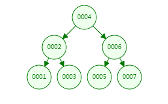
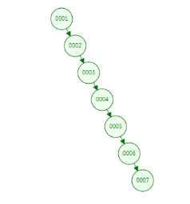
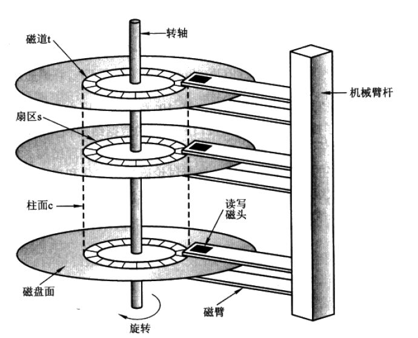

## 二、索引分类

### 0、什么是索引？

索引本质上是一组键值对，其作用是使用数据中某个特定属性作为依据**来快速获得完整数据**，**格式：<索引键：某个属性值，索引值：完整数据 或 完整数据的地址值>**，例如书中的章节目录就是最典型的索引<标题，页数>，通过标题可以快速定位目标数据所在的页数，进而获取数据，无需从起始页一页一页翻找到目标数据。

在MySQL数据库中，索引具有很多类型，它们的区别主要集中在索引键的选取上。

### 1、主键索引 （primary key）

在MySQL数据库中，数据表的主键列会被**默认**创建索引，称为**主键索引**，因此在表查询过程中，使用主键查询的性能非常好。

### 2、普通索引（辅助索引）

根据普通列创建的索引，通过手动创建。需要注意的是，创建普通索引需要生成新的索引结构，因此在数据量较大时，会是一个耗时操作；同时索引的维护也是一个耗时操作，所以在创建普通索引时一定要慎重，只有某列确实是高频查询条件时，才考虑依据此列构造索引。

命令格式：

```mysql
create inde idx_col_name(索引名) on table[col_name]（索引所在的表及列名）
```

### 3、唯一索引

在数据表中，某些列具有**特殊属性**，例如值是不重复的（类似于主键），这样的列可以构建唯一索引，其**性能要优于普通索引**。

```mysql
create unique index idx_col_name on table[col_name]
```

### 4、联合索引/组合索引

表中的多个字段创建一个共同的索引，注意这个索引与列的关系是**1：n**，建议一个联合索引不要超过5个列。联合索引的使用方式和其他索引不太一样，因为其对应着多个列，所以在索引命中上要遵循**最左前缀法则**（第五节详述）。

```mysql
create index idx_col_name1_name2... on table[col_name1, col_name2]
```

### 5、全文索引

全文索引是针对文本内容查询的一种索引结构，应用场景更多的是搜索引擎或大数据引擎中，在MySQL环境不太会出现（虽然MyISAM引擎支持全文索引，但实际开发场景中不会用它），目前使用较多的全文索引软件包括**ElasticSearch**、Solr。

### 总结

对于MySQL数据表来说，一定包含：**至少一个的主键索引**，可以包含：多个普通索引、联合索引。

在查询任务中，能走索引尽量走索引，没有索引可以构建索引，但大量的索引会导致数据表的维护成本升高，因此若是索引过多，则需要考虑是表结构设计有问题或是无法适应当前业务场景的需求。


## 三、存储索引的数据结构

使用索引组织数据可提高数据的查询性能，因此有索引和没索引，差距很大，但同时需要注意的是，**使用不同的数据结构存储索引**也会对性能造成巨大的差异，因此要在不同场景下要选用适合的数据结构存储索引。在下文语境中，使用数据结构存储的**数据**指的就是**索引（包括键和值）数据**，只是因为索引键具有逻辑（可比较）意义，因此**数据结构存储依据是索引键**，索引值就跟着对应的索引键一起存放，索引整体作为一份数据单元。

### 1、线性表

- 数组、链表、栈、队列：没有明确的层级关系，数据之间是相互独立且平等的，数据组织结构是线性的，例如 **字典中的目录** 就是一种线性索引。

### 2、树（索引的灵魂）

树：每个节点存储数据，节点间存在父子关系。

二叉树：每个节点的**度<=2**

- #### 二叉查找树：

  ​	节点间具有明确的逻辑有序关系，一般来说 **左子树 < 父节点 < 右子树（以数值类型来说就是大小关系，以字符串类型来说就是字母序关系，其他类型的话都需要指定一个明确的逻辑关系）**，由于**局部有序**这个特性，所以二叉查找树的查找性能很不错，正常来说都是**二分查找**，理想时间复杂度为**O(logn)**，因此后续树结构都延续了这一基本思想；但二叉查找树的问题在于，**随着节点增多，其整个树结构可能会变得不太友好，进而影响查询性能**，例如在极端情况下，二叉查找树就会退化为一维数组。（对于确定不变的数据来说，直接构造出的二叉查找树就是非常棒的索引结构，但是对于更多的实际场景中，数据是会变的、会增长的，**二叉查找树的结构只是切面高效，而无法做到动态高效**。）

  

  

  ​	到二叉查找树为止，结构都是比较简单的，其构造规则也比较容易理解。二叉查找树的问题在于随着节点增多无法一直保持高效索引，因此需要在节点增删的同时，对二叉查找树的结构也进行调整（后续改进的关键），时刻保持当前数据下的高效索引。

  ​	平衡因子：根节点的一个属性，计算方式为**以当前节点为根节点的树中，左子树高度减去右子树高度**。因为叶子节点也可视为无左右子树的根节点（即0-0=0），因此在一个结构固定的树中，每个节点都有平衡因子。

- #### 平衡二叉树（AVL）：

  ​	平衡二叉树：以二叉查找树为基础，在二叉查找树**插入或删除节点后**，按照特定规则进行**自旋**，以调整树结构，控制每个节点的左右子树的**高度差**，能够达到任何情况下时间复杂度为**O(logn)**。

  - 每个节点的左子树和右子树的高度差不得超过1，即平衡因子的绝对值<=1
  - 平衡二叉树中的每个子树都是平衡二叉树

  ​    平衡二叉树的自旋包括：**左旋、右旋、双向旋转**，每当节点增删时通过自旋来调整树结构，时刻保持高效索引，具体算法参考《算法》

  ​    平衡二叉树确实能做到很好的索引效果（可以说是最棒的），但也存在一个**致命问题**：每次增删节点都进行自旋的代价太大，在数据量较大时，为了达到平衡二叉树的结构调整所耗费的性能，比查询性能还大，所以在实际应用场景中不具备可行性（查询性能高，但维护成本太大）！因此**是一种理想状态下的数据结构**，在实际应用中，需要一个较为折中的方案，即有较好的查询性能，维护成本也可以接受。

- #### 红黑树：

  ​	是平衡二叉树的变种，使用一些约束在**大体上保持树结构的平衡**（有时候是平衡二叉树，有时候不是平衡二叉树，但对于最坏情况也具有不错的性能下限），在较低的维护成本下具有良好的查询性能，是实际应用中很高效的数据结构。

  ​	红黑树的具体细节详见《算法》 或 https://zhuanlan.zhihu.com/p/273829162

  ​	虽然红黑树已经很棒了**，但遗憾的是当数据规模在百万（10的6次方）以上时，树的深度也在20以上**，因此对于数据库这种动辄百万千万上亿规模的数据，以上的所有数据结构都不能很好满足其需求。

- #### B树：

  ​	上述的树数据结构在**树形上已经走到了尽头**（二分查找已经是除了hash查找以外最快的查找了），所以再找解决之道就不能光盯着树形结构；回顾二叉查找树（及其变种）可以发现，在存储数据量较大时，树会变得很深，造成这个现象的主要原因是二叉树的**每个节点只存放一份数据**，每层存储的数据量太少，通过增加深度来增加存储能力的成长率较低；因此若是将**每个节点存储多份数据**，则可以大大减少树的深度，所以将二叉树转为多叉树（节点间依然保持二叉查找树的逻辑有序性）。同一个节点内，**数据间有指针**，按照索引键的逻辑关系指向下层。

  

  ​	B树原理详解：https://zhuanlan.zhihu.com/p/59788528

  ​	B树在一个节点内存储多份数据，所以可以极大增强树在每层所存储的数据量，进而减少树的深度；在MySQL中，一个树节点大小为16KB，假设索引中索引键8B，索引值1KB（实际情况中索引可能更大），指针域6B，因此一份数据（一个索引结构）的大小为1038B，因此一个节点可以存放约15个索引，**百万级数据的B树深度约为5**，相比于红黑树效果显著提升。

- #### B+树：

  ​	B树其实已经较为完善的解决了核心问题即树深度对查询性能造成的影响，在B树基础上进一步改造得到B+树，具备更好的性能与功能。

  ​	B+树详解https://baijiahao.baidu.com/s?id=1692469218111984631&wfr=spider&for=pc

  ​	相比于B树，B+树的特性如下：

  - **非叶子节点**只存放索引键，不存放索引值（键值分离）
  - **叶子节点**冗余非叶子节点的索引键，形式上存放的是完整索引，内容上存放所有数据
  - **叶子节点**按照索引键逻辑关系，从小到大从左到右依次存放（叶子节点内部有序，叶子节点间也有序）
  - **叶子节点**间具有指针，依次连接

  

  ​	从B+树的特性可以得出一些推论：在非叶子节点中，由于只存储索引键，因此一个非叶子节点可以存储大量的索引键，按照上述MySQL环境，索引键8B和指针域6B作为一个组合，16KB的节点可以存储约1170个这样的组合，因此每层数据存储量进一步提升，树深度进一步降低，**百万级数据的B+树深度约为3**。此外，B+树中非叶子节点与叶子节点**功能不同**，非叶子节点中只有索引键和指针域，没有索引值，这意味着非叶子节点实际并不持有目标数据，只是纯粹的辅助查询结构，所有数据都在叶子节点中，**叶子结点存放全量数据（即所有的索引键值）**，包括在非叶子节点中出现过的索引键，**B+树的查询最终都会命中某个叶子节点（如果有）**。由于叶子节点存储完整索引，因此叶子节点只能存储约15份索引，因此一颗深度为n的B+树最大存储量为 1170^(n-1)*15份数据。

  ​	同时，由于B+树叶子结点的全局有序性及通过指针连接，B+树的**区间查询**性能非常好，例如上图中查询索引键>17的数据，先从根节点查询17可以定位到叶子结点（磁盘块6）中的<17，data>，**后续所有数据都不再通过根节点向下逐个查询，而是通过叶子节点间的指针，直接访问后续叶子结点（磁盘块7-9）**。这一特性还可以构造查询缓存，将历史查询的叶子结点缓存，新查询来了可以先尝试通过利用缓存来取数，提升查询性能。

- #### B*树

- #### 难点1：为何查询性能主要受到树深度影响？

  ​	在上述关于索引的数据结构中，性能优化的核心是缩减树的深度，但如何理解查询性能主要受到树深度影响？这就要深入查询过程来解释了。

  ​	首先确定查询过程中主要的性能开销：**从磁盘取出数据**，**进行数据比较**
  
  ​	然后需要明确：平衡二叉树、红黑树、B树、B+树，这些数据结构的核心思路都是构造有序数据，通过折半查找（二分查找）来保证查询性能，因此在查询目标数据时，数据结构上进行的**数据比较次数基本差不多**（甚至B/B+树树比二叉树还要多，因为它们节点内部是线性表），因此**B/B+树查询性能优异与比较次数无关**。
  
  ​	剖析从磁盘取出数据的过程，磁盘上获取数据必须用一个三维地址唯一标示：柱面号、盘面号、块号(磁道上的盘块/扇区)。
  
  
  
  ​		1) 首先移动臂根据柱面号使磁头移动到所需要的柱面上，这一过程被称为定位或查找 。
  
  ​		2) 然后通过盘面号来确定指定盘面上的磁道。
  
  ​		3) 盘面确定以后，盘片开始旋转，将指定块号的磁道段移动至磁头下。
  
  ​	经过上面三个步骤，指定数据的存储位置就被找到。这时就可以开始读/写操作了。
  
  ​    访问某一具体信息，由3部分时间组成：
  
  ​		1) **查找时间(seek time，Ts)** : 完成上述步骤(1)所需要的时间。这部分时间代价最高，**最大可达到0.1s左右**。
  
  ​		2) 等待时间(latency time，Ti) : 完成上述步骤(3)所需要的时间。由于盘片绕主轴旋转速度很快，一般为7200转/分(电脑硬盘的性能指标之一, 家用的普通硬盘的转速一般有5400rpm(笔记本)、7200rpm几种)。**因此一般旋转一圈大约0.0083s**。
  
  ​		3)  传输时间(transmission time，Tt) : 数据通过系统总线传送到内存的时间，**一般传输一个字节(byte)大概0.02us=2*10^(-8)s**
  
  ​	磁盘读取数据是以盘块(block)为基本单位的。位于同一盘块中的所有数据都能被一次性全部读取出来。而**磁盘IO代价主要花费在查找时间Ts上**。因此我们应该尽量将相关信息存放在同一盘块，同一磁道中，或者至少放在同一柱面或相邻柱面上，以求在读/写信息时尽量减少磁头来回移动的次数，避免过多的查找时间Ts。三个时间的差异也很容易理解，查找时间Ts是一个宏观物理动作的耗时，显然其量级会远高于微观物理动作。
  
  ​	至此不难发现，查询性能主要是受到**查找时间Ts**影响，而B/B+树的性能优异正是因为其查找时间Ts较低而形成的，原因在于在B/B+树中，一个节点能存储多份数据，而同样数量的数据在二叉树中需要同样数量的节点，**由于节点作为一个逻辑存储单位，会使用一组连续的扇区，而不同节点则不一定使用相邻的扇区**，因此若n个数据在同一个节点中则只需要一次磁盘IO操作，若n个数据分布在n个不同的节点中则需要n此磁盘IO操作。
  
  ​	因此，假设查询某个数据要进行n次数据比较，对于二叉树及其变种来说，在查询过程中的每一次数据比较，都要从磁盘取出一个节点（即进行一次磁盘IO），因此要进行**n次磁盘IO**，性能开销较大；而对于B/B+树来说，一个节点中存储多份数据，获取同样的数据量所需的磁盘IO次数显著少于前者，在查询过程中大部分数据比较是使用节点内部数据进行的，因此可以视为**在B/B+树中找节点，再在节点内找索引键**，前一个操作是在**磁盘**上进行的，而后一个操作是在**内存**中进行的，而且后一种占了多数，所以要进行**n1次磁盘IO和n2次内存操作**，**满足：n1+n2 = n 且 n2>>n1**。前后两者的磁盘IO次数为n和n1，且n >> n1，因此B/B+树的性能优于二叉树。
  
  ​	总结来说就是 **获取树节点是磁盘操作，树节点内部查找是内存操作，磁盘操作与树的深度正比，而性能开销与磁盘操作成正比，查询性能与磁盘操作成反比，所以查询性能主要受到树深度影响**。

- #### 难点2：什么数据类型适合作为索引键？

### 3、哈希表

从单次存取数据方面来说哈希表来的性能是最好O（1），但由于哈希表本身的一些特性来说并不能很好的支持大规模数据的存储（或者换句话说，无法在大规模数据下继续保持良好的查找性能），且哈希表无法支持范围查询，因此哈希表无法作为数据库中存储索引的数据结构。


##  四、MySQL引擎

### 1、MyISAM

早期引擎，数据与索引分开存放为两个文件，索引的实际内容为**<索引键：某个属性，索引值：完整数据的地址值>**，以"**.MYI**"文件存储索引，以"**.MYD**"文件存储数据，因此一个MyISAM查询包括两个过程：**首先通过索引找到目标数据的地址，然后再通过地址寻址找到目标数据**。

### 2、InnoDB

目前的主流MySQL引擎，数据与索引一体化（或者说索引包含数据），索引的实际内容**<索引键：某个属性，索引值：完整数据>**，使用".Ibd"文件存储索引，因此一个InnoDB查询就是一个过程：**通过索引直接找到目标数据**。可以看出InnoDB从设计上比MyISAM要更快。

- #### 聚簇索引（聚集索引）

  ​	如InnoDB这样的**索引包含完整数据**的形式，称之为**聚簇索引**，所以MyISAM是**非聚簇索引**。

  ​	聚簇索引的优点是显而易见的，它可以**减少一部分的磁盘IO以提高查询性能**，但与此同时，聚簇索引也具有**明显的缺点**。假设对于一张数据表T来说，初始就拥有主键索引（记为index-1），且按照聚簇索引的方式构建主键索引，然后由于业务需要，增加了3个普通索引（index-2、3、4），如果继续按照聚簇索引的方式构建index-2、3、4，那么意味着表T中的**数据需要冗余3份！**首先，从存储空间上来看这是一种极大的浪费，当表T的规模较大时，这种冗余显然是难以接受的；此外，除了数据冗余造成的空间浪费，还要考虑**数据一致性**，当表T中某条数据发生修改时，为了保证数据一致性需要将每个索引中存储的那条数据进行修改，这就造成了**数据的维护成本过高**。

  ​	基于上述原因，**InnoDB引擎使用聚簇索引构建主键索引，使用非聚簇索引构建普通索引**，但这里的非聚簇索引与MyISAM的有些区别，由于InnoDB的主键索引是聚簇索引，因此**表T的完整数据实际上是由主键索引持有**，意味着**能够获取目标数据的主键就约等于能够获取目标数据**，所以**InnoDB的非聚簇索引采用<索引键：某个属性，索引值：这条数据的主键值>格式**，通过普通索引查询时，**先根据普通索引获取目标数据的主键，再通过主键去主键索引中获取目标数据（这个过程也被称为回表查询）**。

  ​	需要指出的是，在**InnoDB引擎中有且只有一个聚簇索引（必有的原因是：表数据要通过聚簇索引存放）**，因此对于**存在主键**的表来说，**主键索引即为聚簇索引**；对于**没有主键**的表来说，表中**第一个非空的唯一索引作为聚簇索引**；以上**二者都没有**的情况下，Innodb引擎会**隐式定义一个6字节的rowid主键来作为聚集索引**。（正常情况下，建议创建表时就指定主键）

- #### 整型自增主键

  ​	因为在InnoDB索引中必然要有主键索引，且根据第三章中对索引存储结构所述（后续称之为**索引树**），可以发现**索引键的选取也是会影响到数据查询性能**，因此当指定数据表的主键时，最好能够采用**整型**、**自增**的字段。

  ​	**整型的优势**：在上述以树为数据结构的索引树中，节点间都是逻辑有序的，因此数值型数据可以很方便的**以数值大小作为逻辑有序的依据**，其他的例如字符串的字母序需要将字符串本身按照规则转换成数值再进行比较确定，因此从计算机原理来说，数值型数据是最高效的，同时由于整型的计算比浮点型计算更高效，所以推荐使用**整型数据**。

  ​	**自增的优势**：结合对平衡二叉树的介绍，可以发现随着数据的不断增加（插入），索引树形会产生变化，为了保持高效的索引能力，需要通过**自旋**来调整树形，因此为了尽量减少调整树形的性能开销，保持主键自增，可以很大程度上减少自旋次数以及自旋工作量（必要的自旋是不可避免的），即**自增的主键可以在一定程度上减少自旋带来的性能开销**。 

- #### 锁

  MyISAM天然支持表锁，InnoDB可以实现行/表锁。

  

## 五、联合索引和最左前缀法则

### 1、联合索引的特点

**使用一个索引来实现表中多个字段的索引效果**。（若是每个字段都单独设置一个索引，则一张表会建立多棵索引树，存在空间浪费等弊端）

### 2、联合索引是如何存储的

正常的辅助索引树中，是以键值对（辅助索引的字段值作为索引键，相应记录的id（主键）作为索引值，形如 **<Bob：3>**）为一个独立单元的，而联合索引将键值对中的键，扩充为多个字段的拼接，形如 **<Bob-15-man：3>**，其他存储细节与普通的辅助索引树相同。

### 3、最左前缀法则

最左前缀法表示则在拥有联合索引的表中，某条使用到索引的sql语句在实际执行时，是否通过联合索引进行检索（即是否命中联合索引，或是进行了全表扫描（遍历））

```sql
# 表概况
select a,b,c from table1; (10, 20, 30)  (10, 40, 50)  (15, 20, 30)
# 创建联合索引
create index idx_a_b_c on table1(a, b, c);
# 以下sql哪些命中联合索引，哪些没有
select * from table1 where a = 10; 命中联合索引中的a
select * from table1 where a = 10 and b = 20; 命中联合索引中的a,b
select * from table1 where a = 10 and b = 20 and c = 30; 命中联合索引中的a, b, c
select * from table1 where b = 20; 没有命中联合索引，因为缺少联合索引中的最左字段值（即a字段值），需要全表扫描
select * from table1 where b = 20 and c = 30; 同上
select * from table1 where a = 10 and c = 30; 命中联合索引中的a，但没有命中c，因此在所有a = 10的记录中，再遍历扫描获取c = 30的记录（半命中）
select * from table1 where c = 30; 没有命中联合索引，因为缺少联合索引中的最左字段值（即a字段值），需要全表扫描
select * from table1 where a = 10 and c = 30 and b = 20; 命中联合索引中的a, b, c（虽然此语句没有按照abc编写，但是mysql会通过内部优化器进行重排，实际执行的是优化后的语句）
```

总结：**若要使用联合索引，则一定要加入最左索引字段**。


## 六、SQL优化

SQL优化的目的是为了SQL语句能够具备优秀的查询性能，实现途径包括：

- 工程优化：数据库标准、表结构标准、字段标准、索引标准、公共约定
- SQL语句优化：当前SQL语句是否命中索引

### 1、工程优化

每个公司都有自己的标准，此处可以参考58的《MySQL军规升级版》

### 

### 2、Explain执行计划——MySQL优化工具

SQL优化可以从两个角度来理解：一是在编写一条SQL语句时（主要针对查询语句），需要**提前注意的事项**，尽量**在编写时就能使其具有理论上的优秀执行性能**。二是针对已经编写好的（或现存的）SQL语句，需要通过**实际运行验证来确定其执行性能**，并在目前的基础上进行改进与优化，达到更好的执行性能。二者是相互关联的，通过对现有SQL语句的优化可以让我们学习到什么样的SQL是好的，进而促进编写SQL的能力。此处我们以第二点为基础，对现有SQL语句进行优化。

- #### 慢SQL语句

  ​	将**执行时间>=1s(1000ms)**的SQL语句称为**慢SQL**（不同查询内容可能标准不同一样，但基本上秒级别或接近秒级别的查询都需要优化），这类SQL语句是优化的主要目标。

- #### SQL语句分析

  ​	在一条SQL查询语句**前加explain关键字**，可以得到这条语句的**执行参数**，以便分析语句本身的性能，包括：是什么类型的查询、可能涉及到的索引等

```mysql
explain select * from Table where name like "Li%"
```

